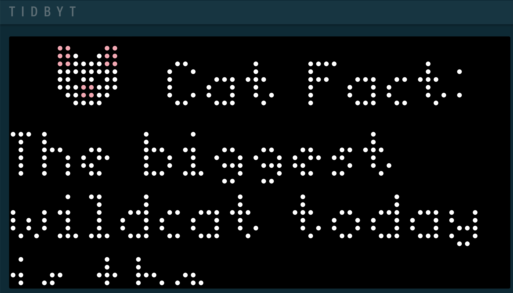

# Tidbyt

Creating random applicaitons for my Tidbyt.  Just for fun.  

https://tidbyt.dev/docs/build/build-for-tidbyt

### Installing Tidbyt

```
brew install tidbyt/tidbyt/pixlet
```

### To render your application in a local host:

```
pixlet serve catfact.star
```

## Catfact

Catfact is a simple applicaiton that displays a random fact about a cat served up from [Catfact.ninja](https://catfact.ninja/).

It demonstrates a few simple concepts.

1. How to make a HTTP request to an API
2. Caching the API request so that you don't hit the server too often - every 4 minutes in this case.
3. base64 encoding an image to display it in the application.
4. Layout tools to display a header as well as a vertially scrolling Marquee.

